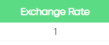

 
 
Now you are in Currency page

## Name
 
 
Here you see the name of a currency

## Arabic Name
 
 
Here you see the name of a currency in Arabic letters

## Exchange Rate
 
 
This column refers to the conversion of a foreign currency to SAR (Saudi Arabia Ryial) currency

## Date
 
When you add a currency the date will be generated automatically at this column