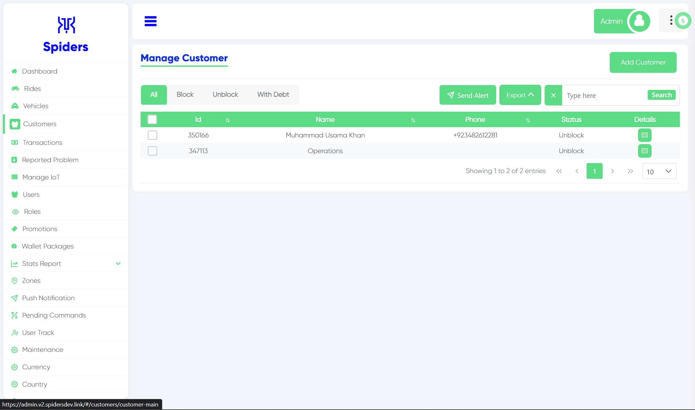 
Customers Interface

## All Customers
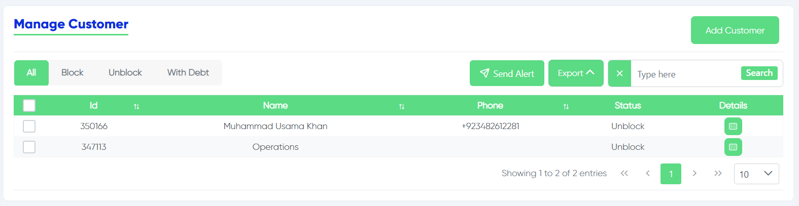 
This shows all the customers without filters

## Blocked Customers

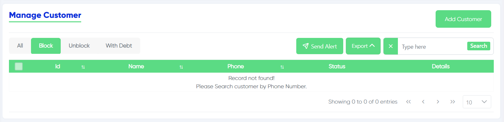 
This one shows the blocked customers only

## Unblock Customers
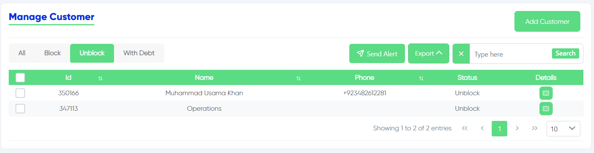 
This one shows the unblocked customers only

## Customers With Debt
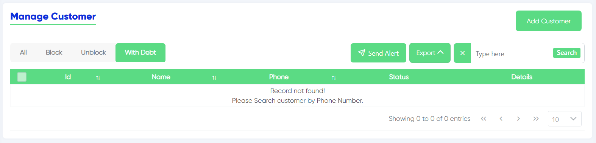 
This list shows the customers with their debts

## Send alert
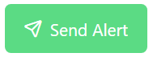 
This button allows you to send alert to the customer

## Customer ID
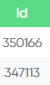 
This column shows the ID of the customer

## Name
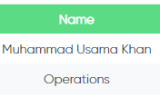 
Here you can see the name of the customer

## Phone
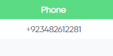 
The phone number of the customer is shown in this column 

## Status
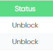 
Here you can see the status of the customer (Block, Unblock) 

## Details About Customers
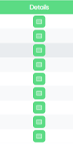 
When you click this button it gives you more details about the customer

## Customer Info
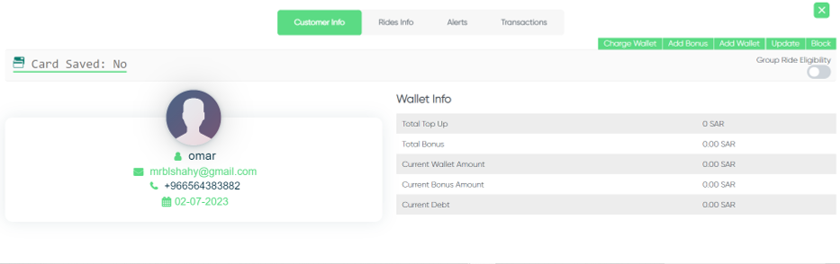 
The First option shows you the customer info

## Rides Info
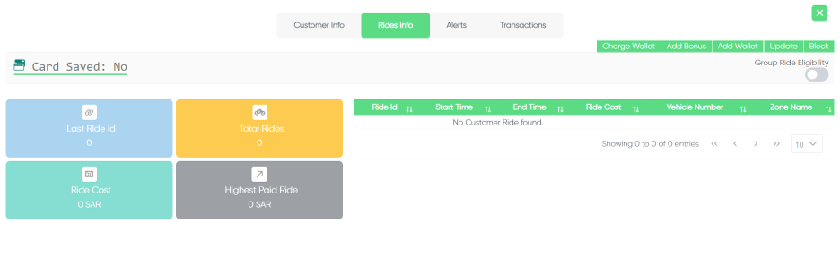 
The Second option shows you the rides info of the customer

## Alerts
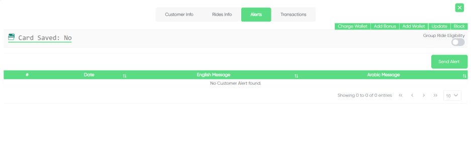 
The Third option shows you the alerts with that customer

## Translations
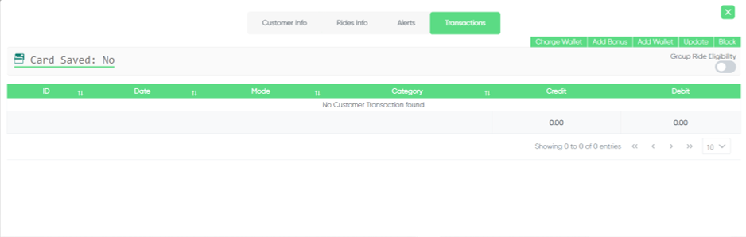 
The Fourth option shows you the transactions that this customer made

## Add Charge
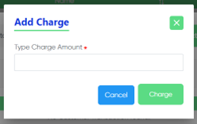 
If you want to add charge or credit to the wallet of the customer click on "Charge Wallet" on the top right

## Add bonus
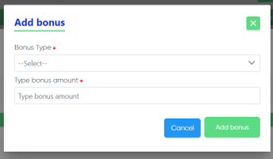 
If you want to add bonus amount of credit click on "Add Bonus" on the top right 

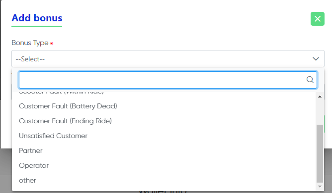 
Then add the reason of the bonus (Partner, Operator, Customer fault, Other) and the amount of the bonus

## Add Wallet
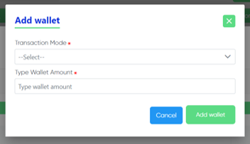 
To add a wallet to the customer click on "Add Wallet" on the top right then add the transaction mode and the wallet amount

## Update Customer
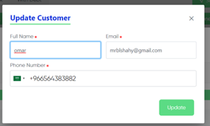 
To update the customer info click on "Update" on the top right then this page will appear

## Block Confirmation
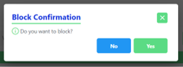 
If You want to block this customer click on "Block" on the top right then this page will appear