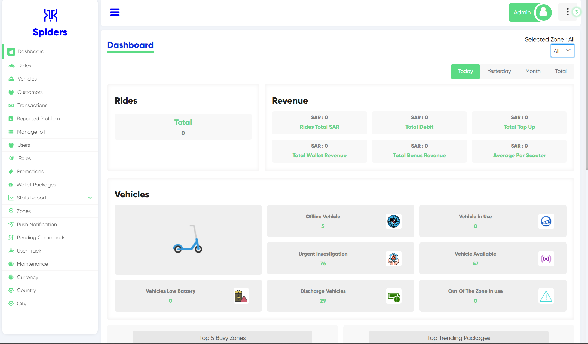
 
Here, you are in the dashboard page.

## Selected Zone
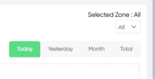
 
Here you can select any zone you want to see informations about a specefic zone in either today, yesterday, or a month.

## Rides
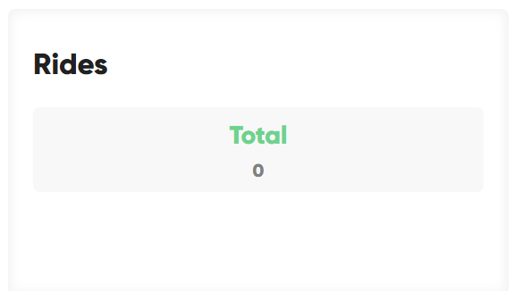
 
Here is the total number of rides

## Revenue
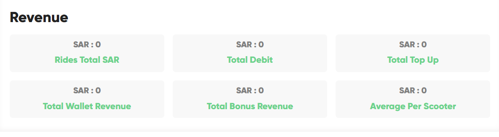
 

- **Rides Total SAR:** shows total revenue of rides
- **Total Debit:** this shows the total debt on customers
- **Total Top Up:**
- **Total Wallet Revenue:** this shows the total of wallet revenue only
- **Total Bonus Revenue:** Here you will see the total revenue of bonus only
- **Average Per Scooter:** this is the average revenue per scooter

## Vehicles
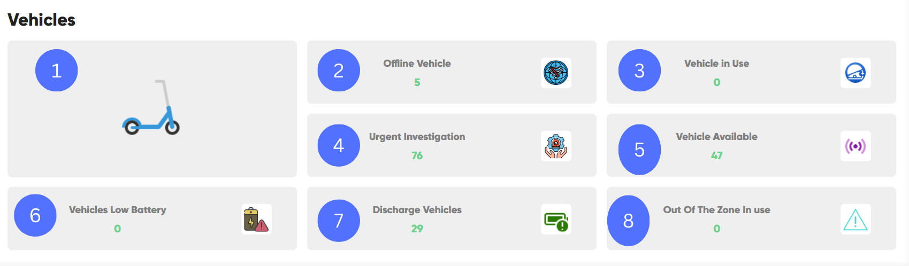
 

1. Here you can see vehicle type (scooter, e-bike, etc..).
1. How many offline vehicles there are.
1. How many in use vehicles right now.
1. The number of vehicles that need urgent investigation.
1. How many vehicles are available right now.
1. The number of vehicles that have low battery.
1. The number of vehicles that have 0% battery.
1. The number of vehicles that are in use right now but outside of zones.

## Top 5 Busy Zones
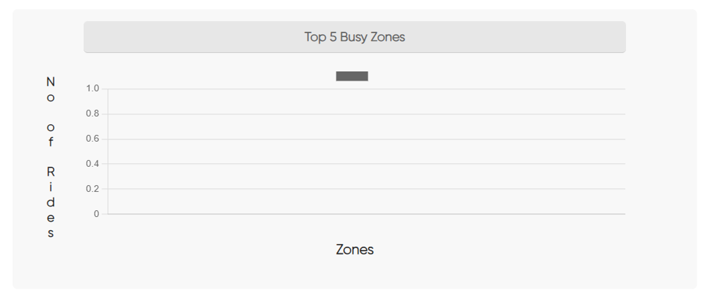 
This chart shows top 5 busy zones or crowded zones

## Top Trending Packages
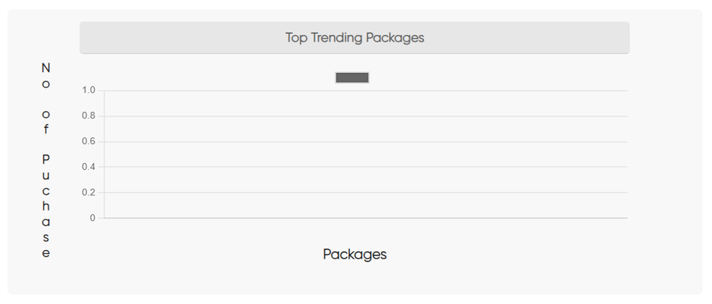 
Here you will know what packages are the most used by customers

## Peak Hours
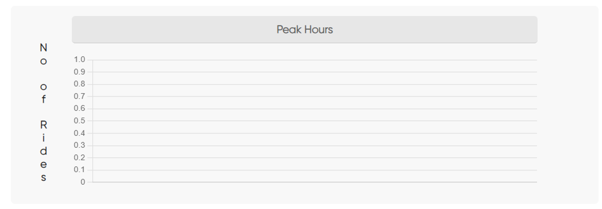 
This chart shows rush hours in descending order

## Top Trending Vehicles Type
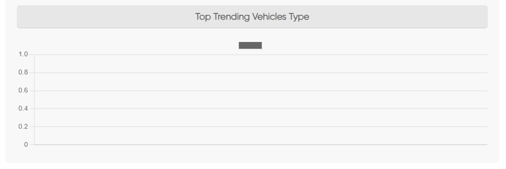 
This shows the most preferd vehicle type

## Top Trending Vehicle Company
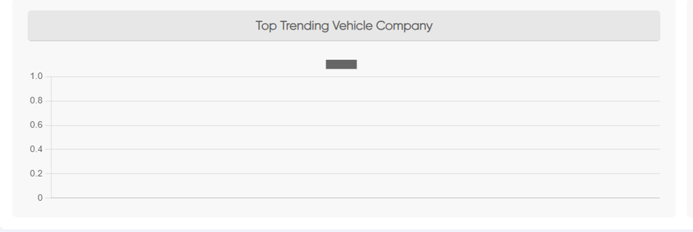 
Here you can see what is the most vehicle company that has been used by users

## Top 5 Zone Revenue Wise
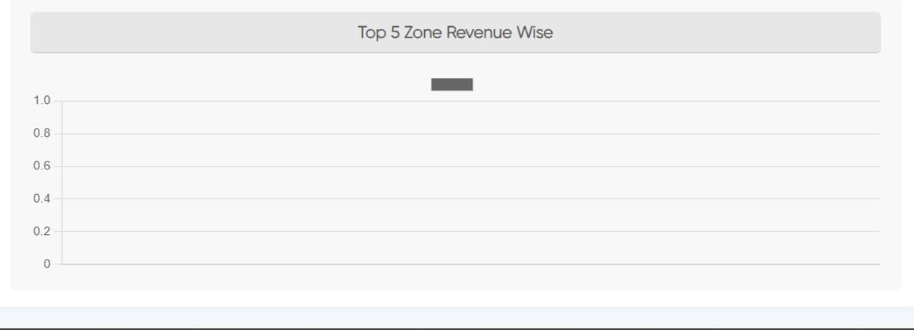 
Here you can see the top five zones that get revenue.