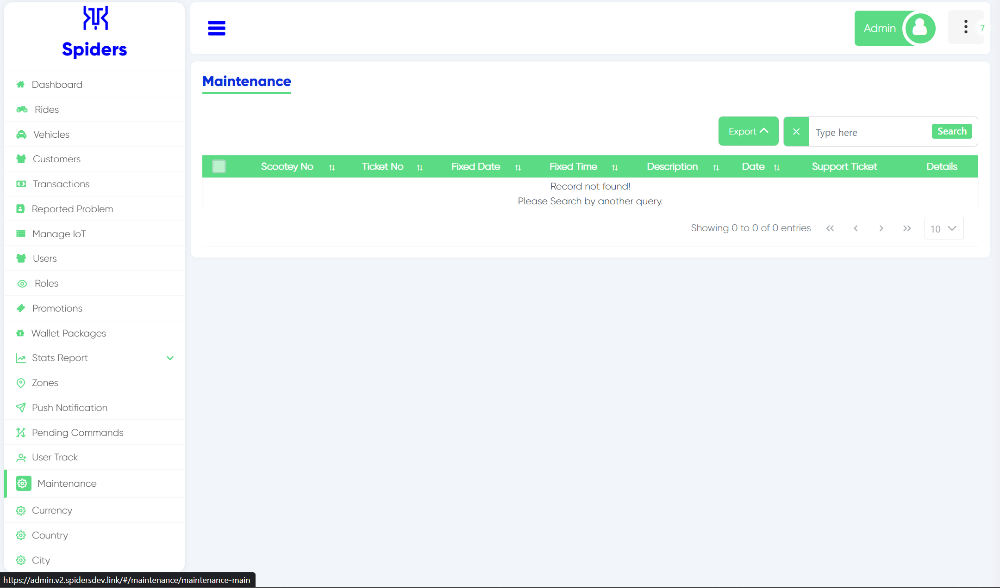
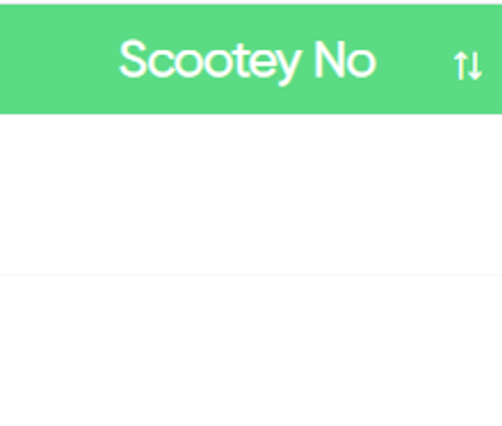
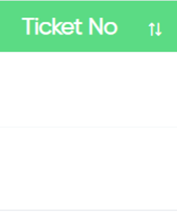
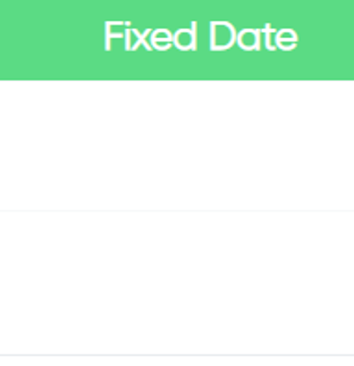
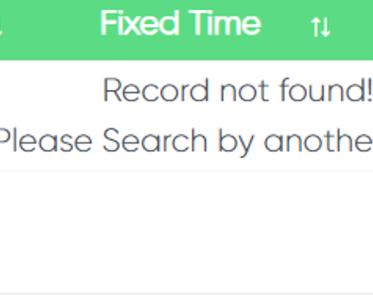
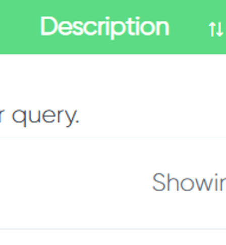
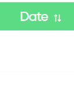
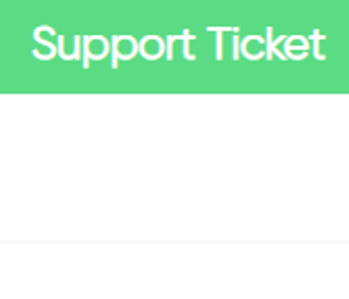
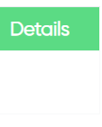

Maintenance Interface

## Search and Export

Click export to download the file in your computer also you can search for specific thing.

## Scootey No
  
Here you can see the number of the scooter

## Ticket No
  
In this column you can see the ticket number

## Fixed Date
  
The date on which the scooter was fixed

## Fixed Time
  
The time on which the scooter was fixed

## Description
  
If any description written it will be shown here

## Date
 
When you Create a maintenance ticket, the date will be generated automatically

## Support Ticket
  
The ticket that was sent to fix the scooter

## Details
  
More details will be shown here

