 
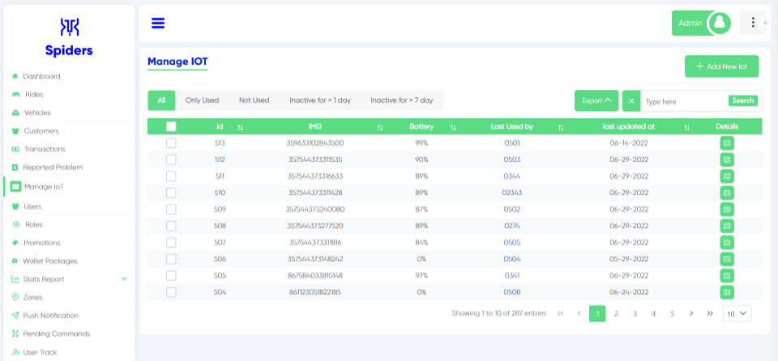 
Manage IoT Interface
 

## Add New Iot
  
This button allows you to add a new IoT device
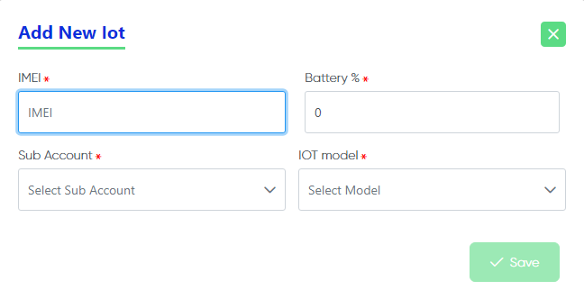  
If You clicked the button "Add New IoT" this page will appear, to add a new IoT device you need to fill every blank

## Id
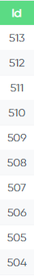  
In this column it shows the ID of the IoT device
 

## IMEI
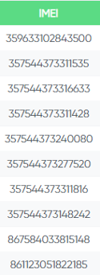  
Here you can see the IMEI of the IoT device which is like the serial number or basically the number of the device

## Battery
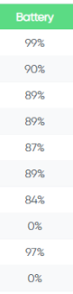
 
Here you can see the battery percentage of the IoT device

## Last Used by
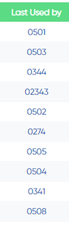
 
This column shows that which the last vehicle used this IoT device 

## Last updated at
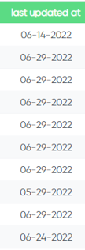
 
Here you can see when was the last time this IoT device was updated
 

## Details
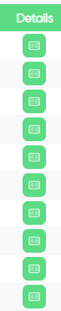  
For more details click on this icon

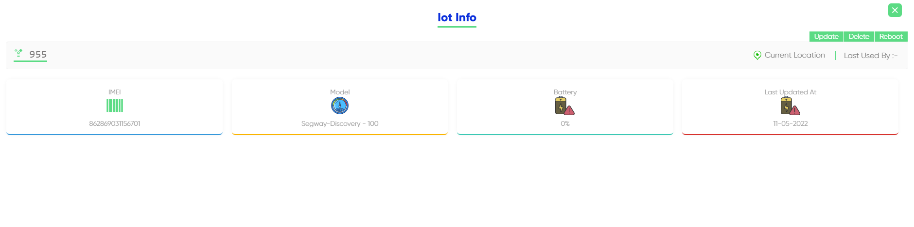  
This page will show up when you click on the details icon it includes an information about the IoT device, also you can (Update, Delete, Reboot) the IoT device  

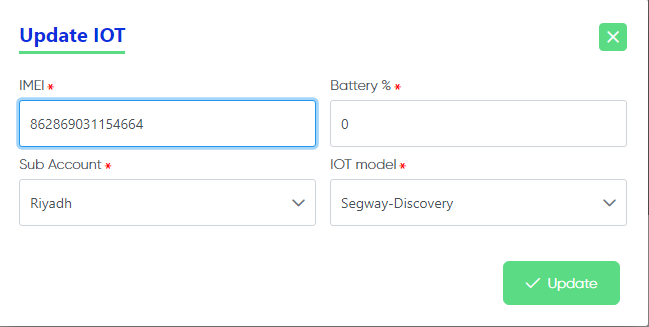  
You can "Update" the IoT device by clicking the button on the top right  

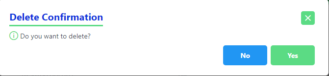  
You can "Delete" the IoT device by clicking the button on the top right  

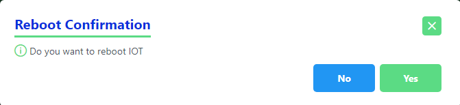  
You can "Reboot" the IoT device by clicking the button on the top right 
