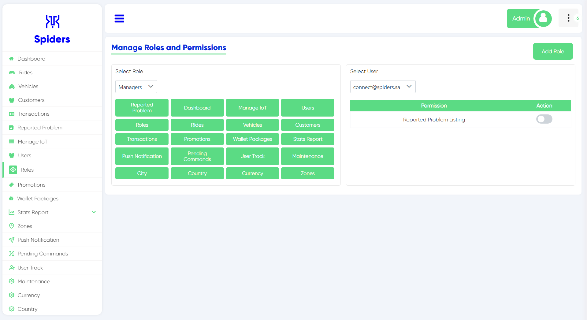
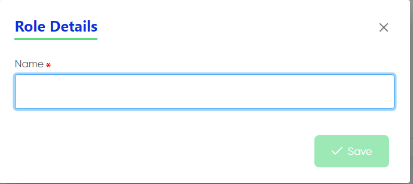
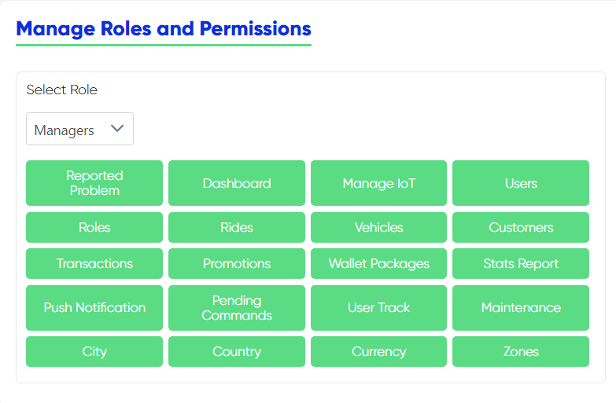
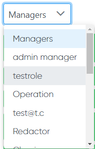
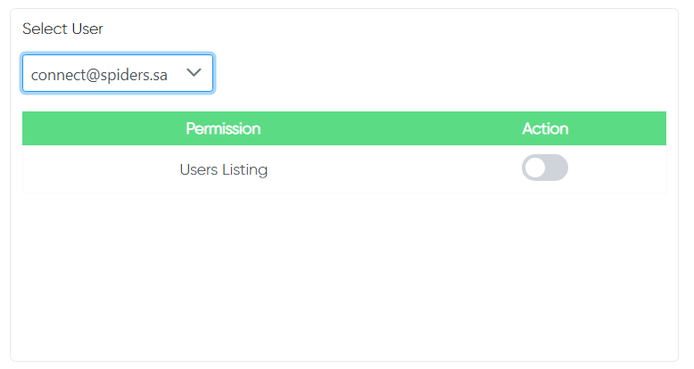
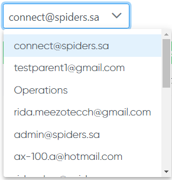

 
Roles Interface

## Add Roles
 
You can add a role if you clicked on this button

 
This page will appear after you click on "Add Role" then you can write the role details

## Manage Roles

 

 
Here you can select roles and manage them by adding or removing specific job duties or specific files access

 

## Select User 

  
Here you can select the user himself to see his role and to give or remove a permission
 

