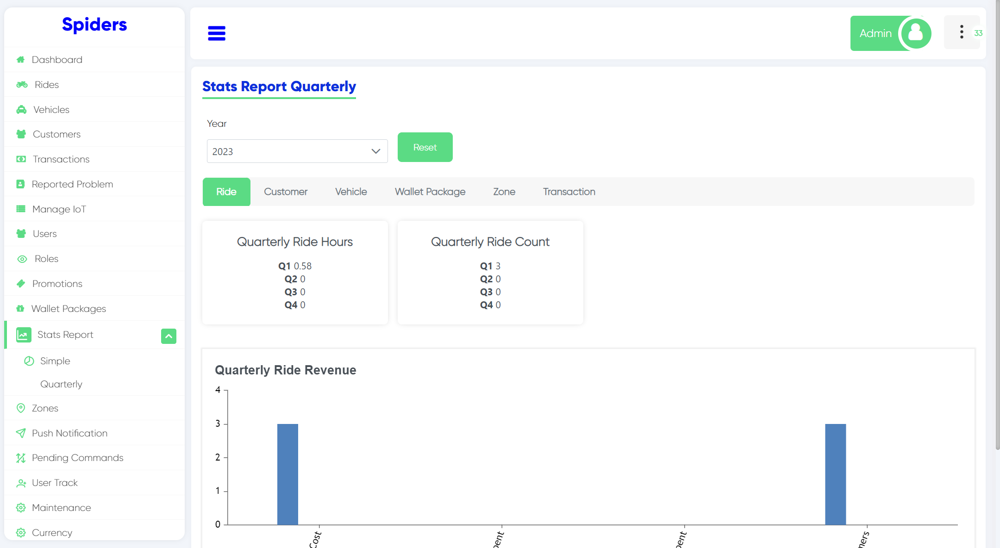
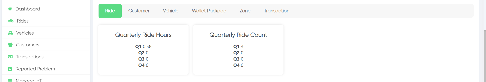
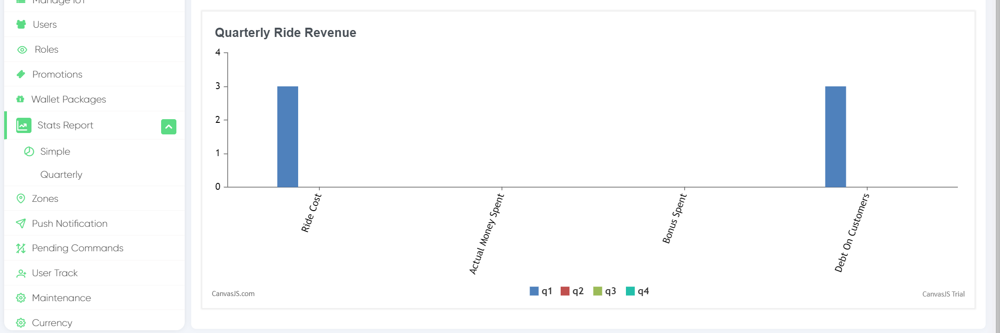
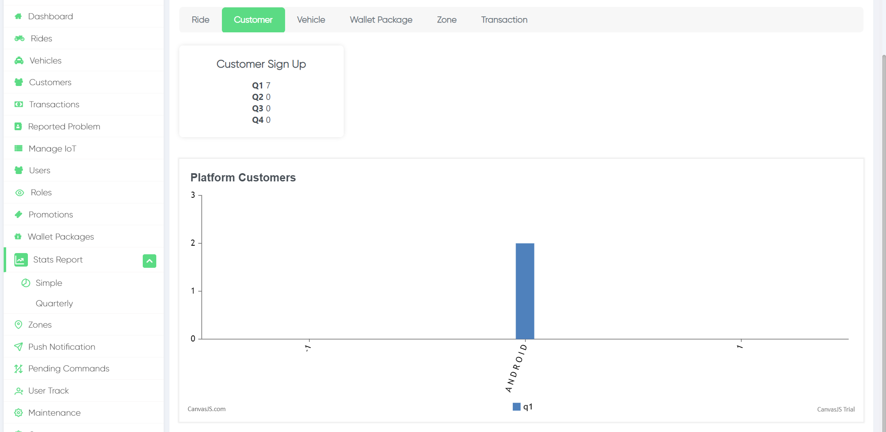
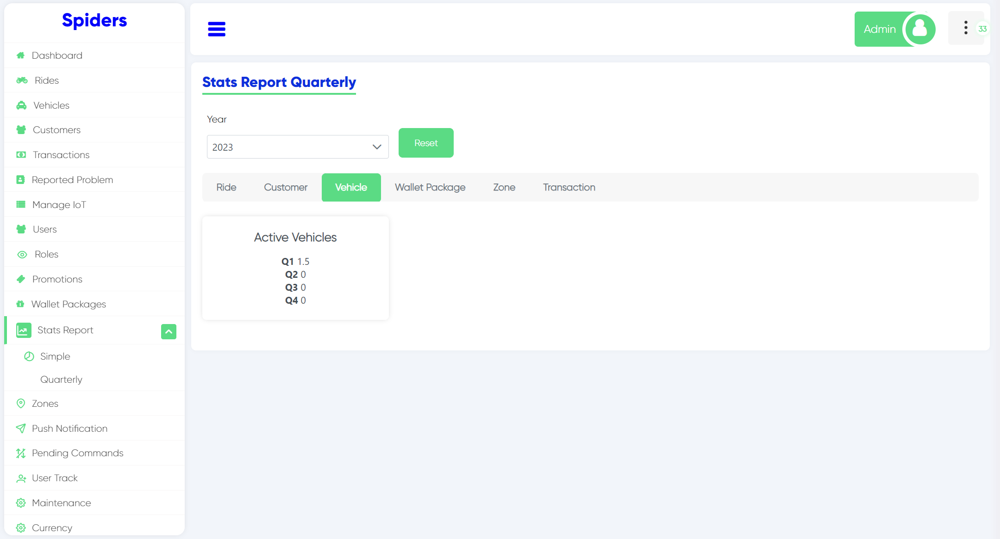
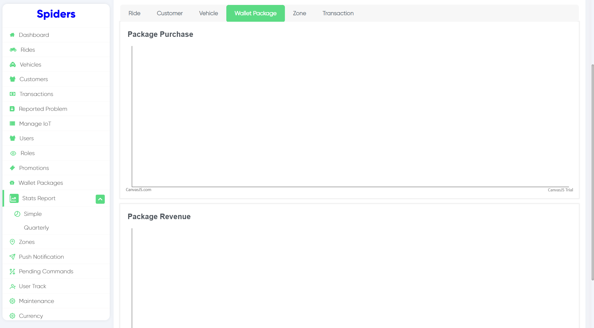
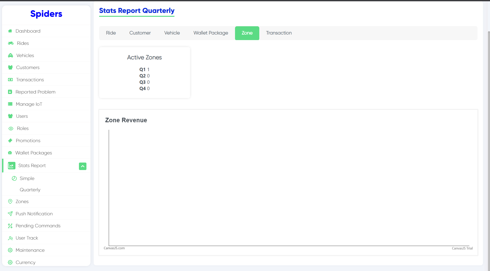
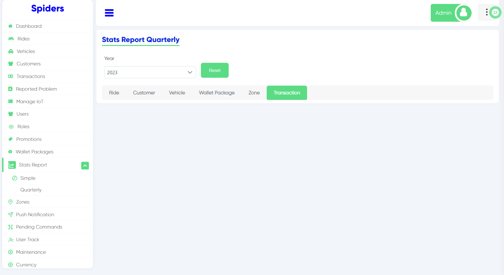

 
Now you are in quarterly reports statistics

## Ride Stats Report Quarterly

 

**Quarterly Ride Hours**: this summarization shows ride hours of every quarter 
**Quarterly Ride Count**: shows ride Count of every quarter

### Quarterly Ride Revenue

This chart shows the quarterly revenue

## Customer Stats Report Quarterly

 
In customer statistics you can see the number of sign ups in every quarter. 
The chart shows platform customers

## Vehicle Stats Report Quarterly

 
In vehicle statistics you can see active vehicles on every quarter

## Wallet Package Stats Report Quarterly
 

**Package Purchase Chart:** shows the number of purchaes of packages in every quarter 
**Package Revenue Chart:** shows revenue of packages on every quarter

## Zone Stats Report Quarterly

 
Zone statistics shows active zones on every quarter, and the chart tell you about zone revenue of a quarter

## Transaction Stats Report Quarterly

 
Here you can see the transaction statistics