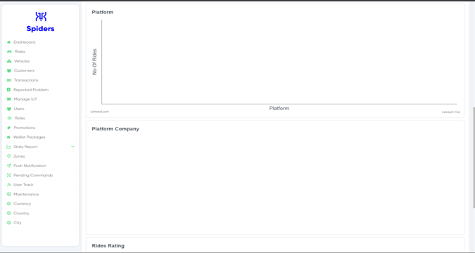
 
Now you are in simple stats reports dashboard

## Filter Date
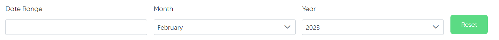
 
Here You can filter statistics by date

## Rides Statistic Reports
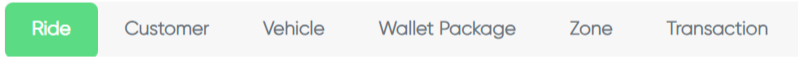
 
If you click on Ride label this page will appear to you

### Rides Rating
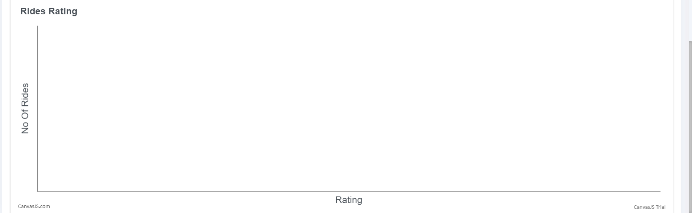
 
This chart shows ride rating. number of rides in y-axis and rating in x-axis

### Company Revenue
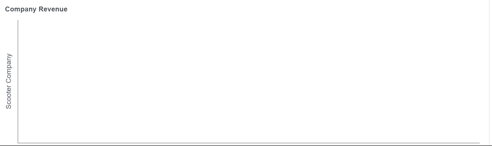
 
This chart shows company revenue

### Platform Company
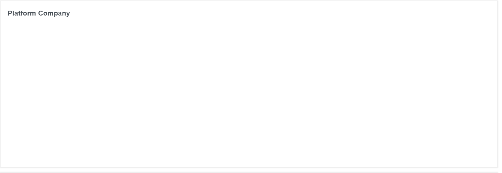
 
This chart shows the number of rides of every scooter's company

## Customer Statistic Reports
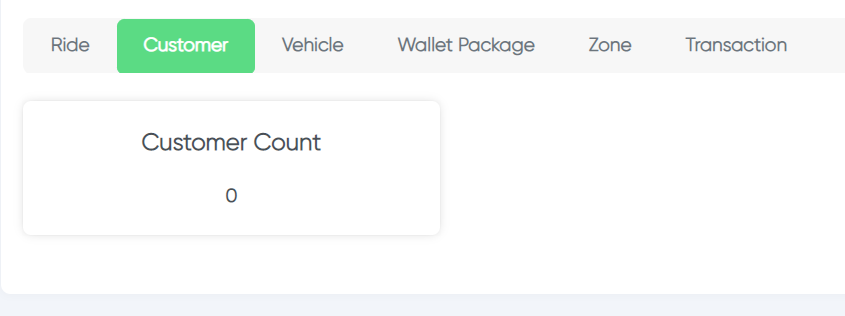
 
Here you can see the number of customers

### Platform
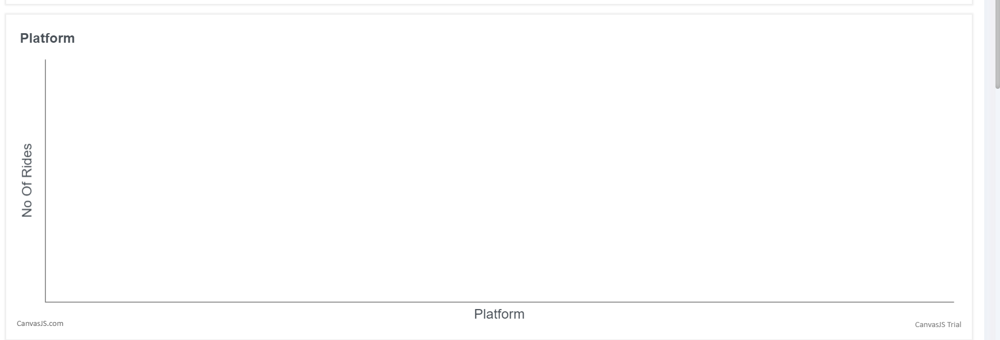
 
This chart refers to the number of rides of a single platform

## Vehicle Statistic Reports
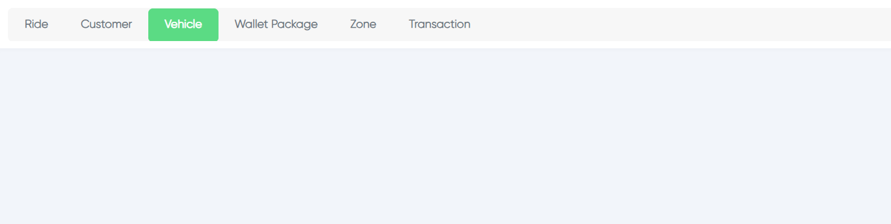
 
If you click on vehicle label this page will appear to you

## Wallet Package Statistic Reports
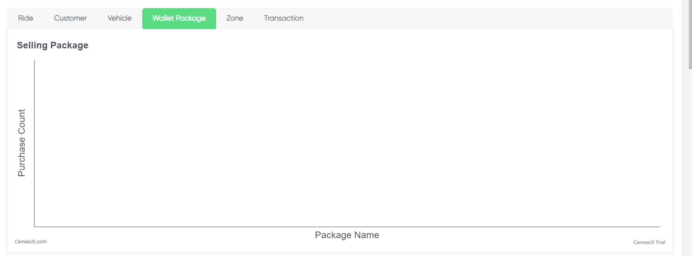
 
If you click on wallet package label this page will appear to you

### Wallet Package
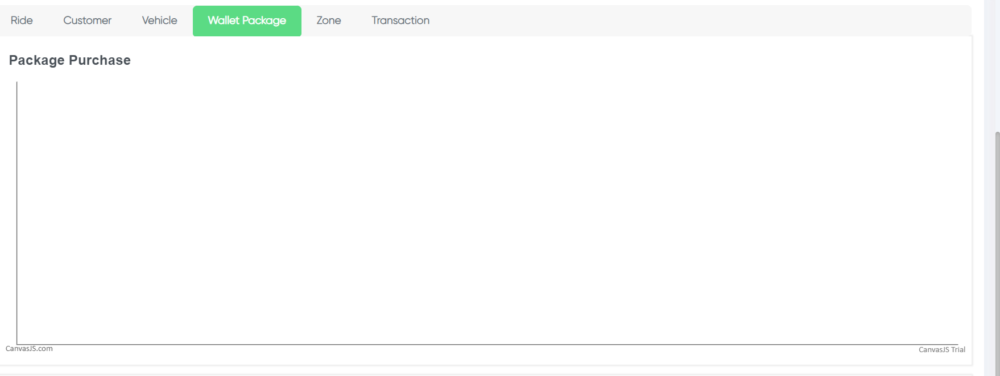
 
purchased package chart shows the most purchased packages by the users

### Purchase Rate
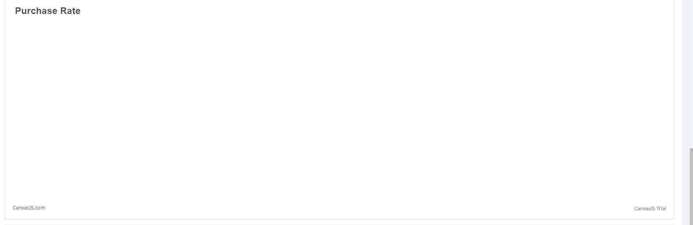
 
Here you can see the rate of purchased packages

### Revenue Package
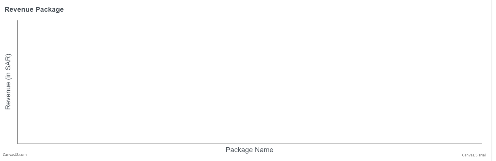
 
This chart refers to the revenue of every package

### Most Revenue Package Rate
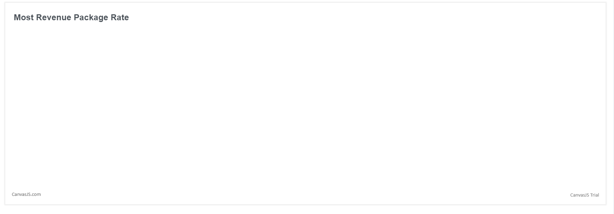
 
This chart tell you about what is the most revenue package rate

## Zone Statistic Reports
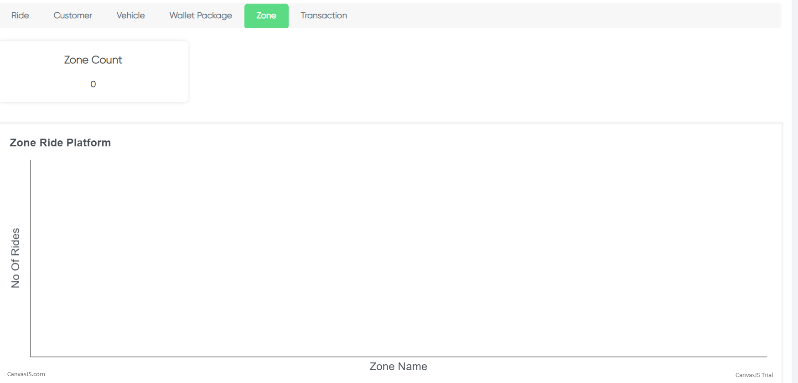
 
This chart shows the number of rides on every zone

### Zone Top Up Burned
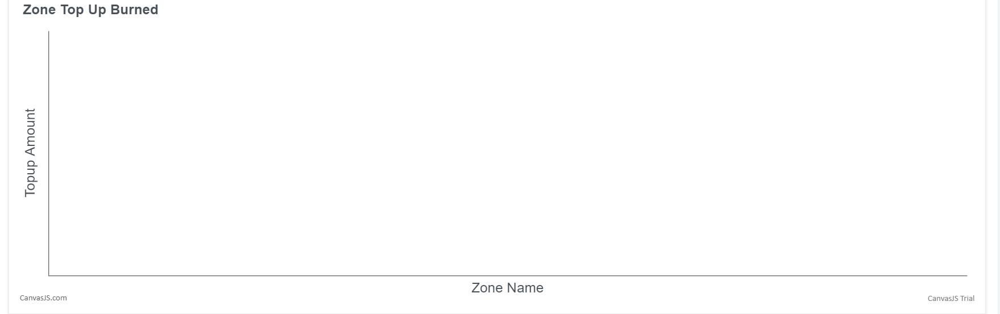
 
This chart shows how much they consumed, means how much remains in users wallets

### Zone Top Up Ratio
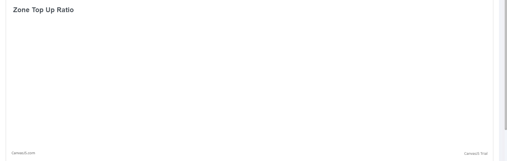
 
This chart shows the ratio of zone that people recharged or purchased packages

### Zone Age
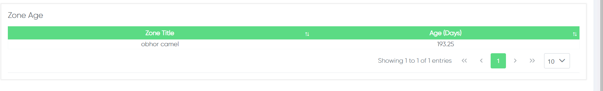
 
Here you can see when the zone has created

### Zone Revenue
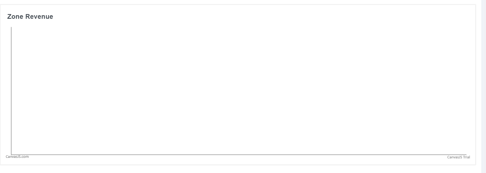
 
This chart shows the revenue of every zone

## Transaction Statistic Reports
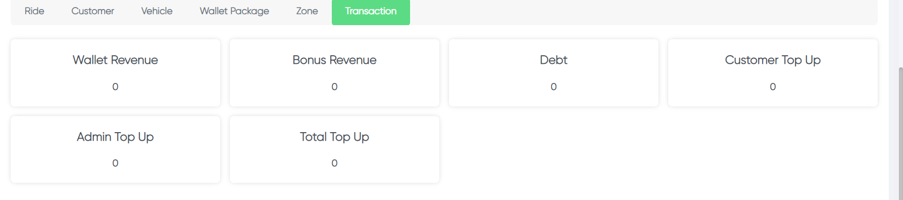
 
In the transactin statistics you can see a summary of wallet revenue, bonus revenue, debt, customer top up, etc...

### Transaction Count
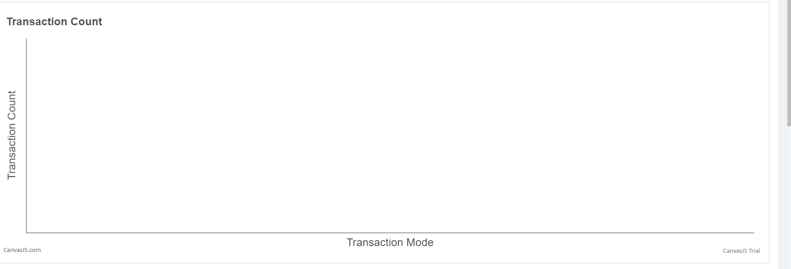
 
This chart shows a counted number of transactions of every transaction mode

### Transaction Amount
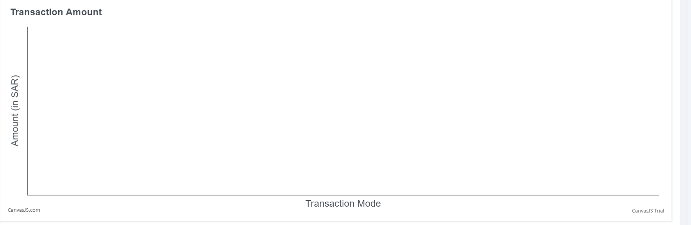
 
This chart shows the amount of transactions of every transaction mode

### Transaction Percent
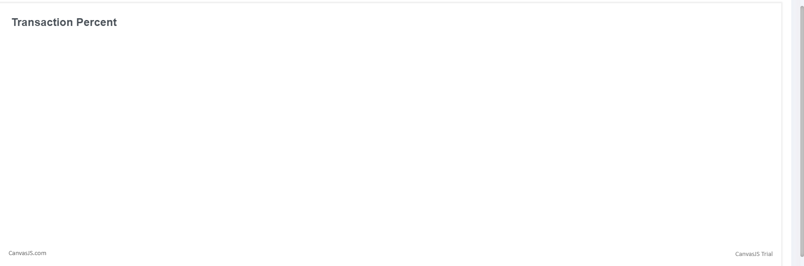
 
This chart shows the percentage of transaction modes