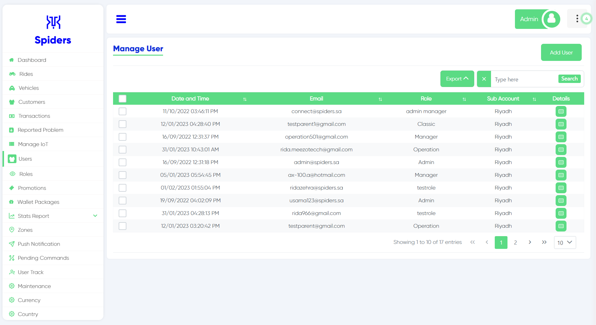
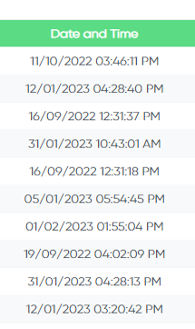
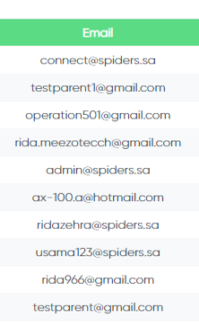
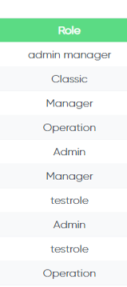
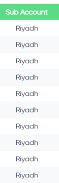
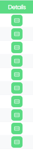
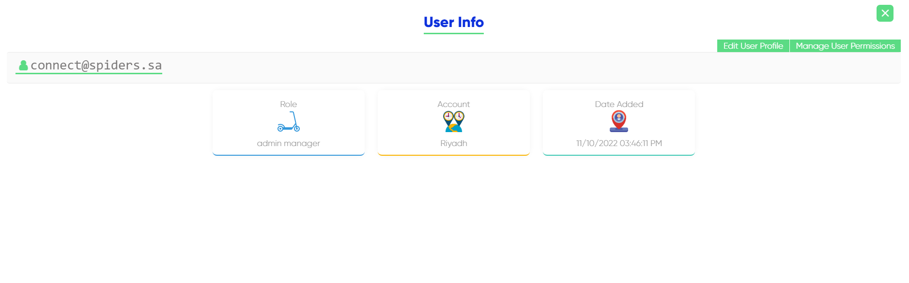
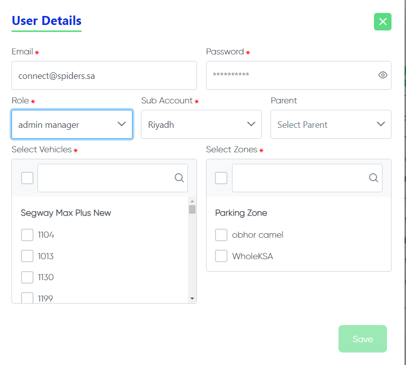

 
This is Users Interface

## Date and time

 
The date and time when the user were added

## Email

 
The Email of the user

## Role

 
The role of the user

## Sub Account

 
Location of the user

## Details
  
For more details click on this button

  
when you click on the details button this page will appear

  
When you click on "Edit User Profile" in the previous picture another page will appear and you can edit more details (Email, Password, Role)

