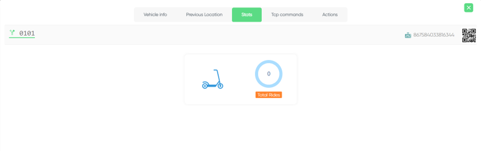

 
Vehicles Interface

## Status

 

 

 
These are all the status of the vehicles

## Scooter

 
Here you can see the scooter number

## Company

 
This column shows the company that manufactured the scooter

## Type

 
This column shows the type of the vehicle

## Battery

 
Here you can see the battery percentage of the vehicle

## Zone

 
This column shows in which zone the vehicle is

## Detalis

 
For more details you can click on this button it will open a page consisting of five elements

## Vehicle info

 
The First one is Vehicle info which give you more informations about the vehicle

## Previous Location

 
The Second one is Previous location which shows you where did the vehicle parked last time with a photo from the previous user

## Stats

 
The Third one is Stats which gives you more stats about the vehicle for example (Number of rides, Number of maintenance times, etc...)

## Tcp commands

 
The Fourth one is Tcp commands which allows you to control over the vehicle and send commands as an admin for example (Lock, Unlock, etc...)

## Action

 
The Fifth one is Action which allows you to take actions to the scooter (Update, Delete, Change location)

## Update

 
Here you can update the vehicle details

## Delete

 
Here you can delete the vehicle from the database

## Change Location

Here you can change the location of the vehicle

