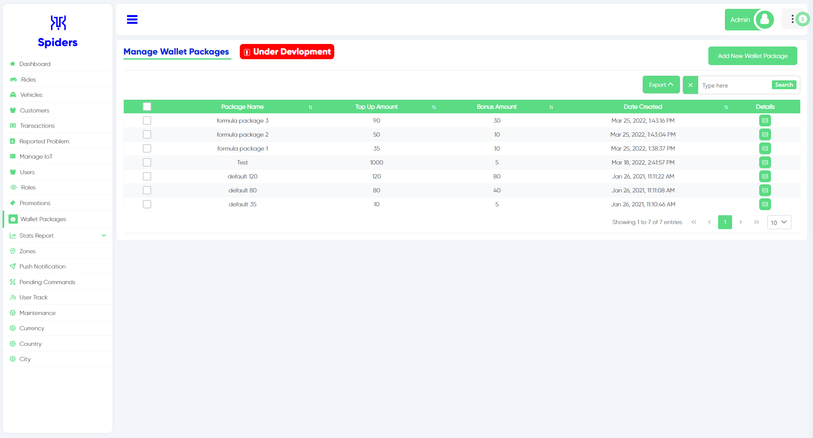
 
Wallet packages Interface

## Add New Wallet Package
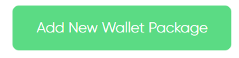  
Click on this button to Add New Wallet Package

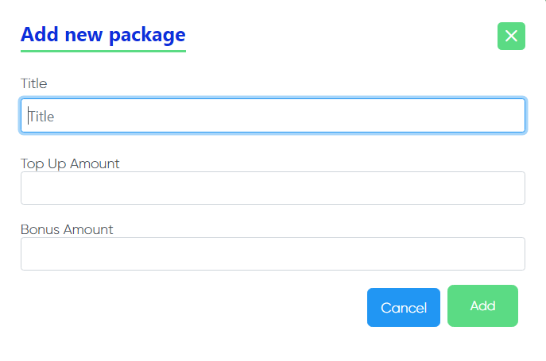  
This page will appear after clicking the "Add New Wallet Package"
 

## Export and Search
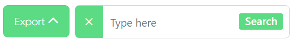
 
Click export to download the file in your computer also you can search for specific thing.

## Package Name
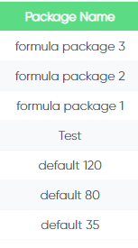
 
Here you can see the package name

## Top Up Amount
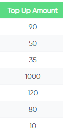
 
This is the main amount of the package without the bonus

## Bonus Amount
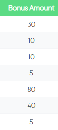
 
This is the bonus amount added within the package

## Date Created
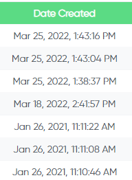
 
The date and time were the package was created

## Details
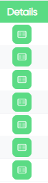
 
When you click on the details button a 3 pages will appear
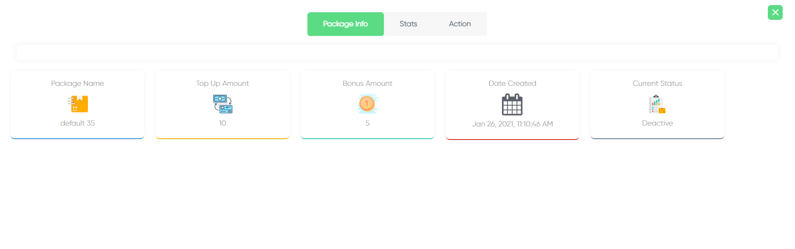  
The First page is Package info it gives you more information about the package
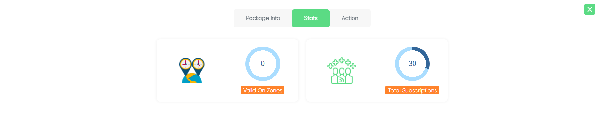  
This is the Second page and it shows you more stats

You can take more actions in the Third page (Change status, Edit)

