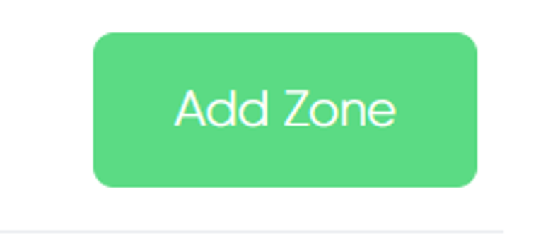
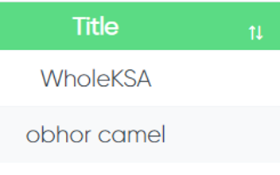

Now you are in zone page

## Add a Zone
 
If you want to add a zone, click on this button

## Zone Details - Basic Details

When you add click on **"Add Zone"** button, this page will appear to you which contains 4 steps:   

1. Basic Details
2. Basic Setting
3. Draw a Zone
4. Zone Fare

In the first step you need to write basic details about the zone that you want to add like (country, City, Zone Type, Title)

## Zone Details - Basic Setting

In the second step you need to write basic setting about the zone that you want to add like (select start time, select end time)
 
 

 

**RideEnd With In Zone**: This toggle is to force users to end ride inside a zone only 
**Segway Throttle Command**: 
**Nearby RedZone**: 

## Zone Details - Draw a Zone

In the third step you can draw a zone area

## Zone Fare

In the fourth step you need to write Ride type, vehicles company, etc...

## Zone Status
 
Here you can filter and show active or inactive zones

## Search For a Zone
 
Write the name of a zone and its information will appear to you

## Zone Info

When you click on details button you will see many informations about a zone like zone name, default speed, min wallet balance, etc...

## Zone Fare Setting

Zone fare setting will show ride type, vehicle company, time pric, KM price, etc..

## Zone Map

Here you will see where the zone is located

## Table Information

## ID
 
this a zone ID

## Title
 
This is the name of zone

## Zone Type
 
this column refers to the zone type like "parking zone"

## City
 
Here you will find in which city the zone is located

## Created At
 
Once you have created a zone the date will be generated automatically

## Zone Details
 
This button shows more details about a zone